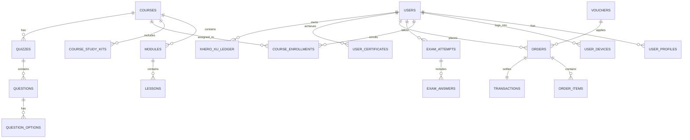
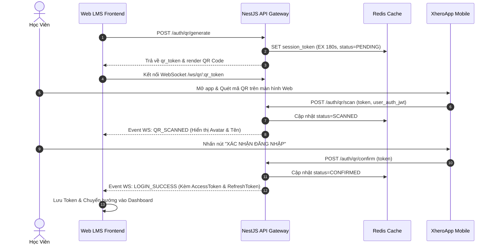

# TÀI LIỆU ĐẶC TẢ YÊU CẦU NGHIỆP VỤ & KIẾN TRÚC HỆ THỐNG (BRD & SYSTEM ARCHITECTURE)
## DỰ ÁN: NỀN TẢNG ĐÀO TẠO & KHẢO THÍ HUYỀN HỌC TRỰC TIẾP - PHONG THỦY ĐẠI NAM (LMS REBUILD)
**Đơn vị chủ quản:** Viện Phong Thủy Khoa Học Toàn Cầu - Phong Thủy Đại Nam  
**Mục tiêu dự án:** Tái cấu trúc và nâng cấp toàn diện (Rebuild) nền tảng đào tạo trực tuyến [https://daotao.phongthuydainam.vn/vi](https://daotao.phongthuydainam.vn/vi)  
**Tài liệu tham chiếu:** Hệ thống nhận diện thương hiệu & quy chuẩn đào tạo Phong Thủy Huyền Học Đại Nam  
**Chuyên viên phân tích nghiệp vụ (Lead/Writer):** Nguyễn Quốc Toàn  
**Phiên bản:** v2.0 - Rebuild Release  
**Ngày phát hành:** 11/09/2026  

---

## MỤC LỤC TÀI LIỆU

1. [TỔNG QUAN DỰ ÁN & MỤC TIÊU TÁI CẤU TRÚC](#1-tổng-quan-dự-án--mục-tiêu-tái-cấu-trúc)
2. [HỆ THỐNG NGƯỜI DÙNG & MA TRẬN PHÂN QUYỀN (RBAC)](#2-hệ-thống-người-dùng--ma-trận-phân-quyền-rbac)
3. [ĐẶC TẢ CHI TIẾT CÁC PHÂN HỆ CHỨC NĂNG (FUNCTIONAL REQUIREMENTS)](#3-đặc-tả-chi-tiết-các-phân-hệ-chức-năng-functional-requirements)
   - 3.1. Phân hệ Xác thực & Bảo vệ Bản quyền (Auth, Onboarding & DRM)
   - 3.2. Phân hệ Danh mục Khóa học & Lộ trình Học thuật (Course Catalog & Roadmap)
   - 3.3. Phân hệ Chi tiết Khóa học, Giáo trình & Hộp Dụng cụ Phong thủy (Course Detail & Study Kits)
   - 3.4. Phân hệ Trình phát Video Học tập & Quản lý Tiến độ (Interactive Video Player)
   - 3.5. Phân hệ Động cơ Khảo thí & Chấm thi Đa hình thức (Assessment & Examination Engine)
   - 3.6. Phân hệ Đơn hàng, Giỏ hàng & Cổng Thanh toán Đa kênh (Order & Checkout Gateway)
   - 3.7. Phân hệ Kích hoạt Khóa học bằng Mã Code (Course License Activation)
   - 3.8. Phân hệ Hồ sơ Cá nhân & Hệ thống Thăng hạng Danh vị (Student Portal & Rank Progression)
   - 3.9. Phân hệ Gamification, Vinh danh Rồng Vàng & Cấp Chứng chỉ Điện tử (Leaderboard & Certification)
   - 3.10. Phân hệ Giới thiệu Bạn bè & Tích lũy Điểm thưởng XheroXu (Referral & Loyalty Ledger)
   - 3.11. Phân hệ Cổng Tin tức, Bài viết & Thu thập Khách hàng Tiềm năng (News & Lead Capture)
4. [QUY TẮC NGHIỆP VỤ CỐT LÕI (BUSINESS RULES)](#4-quy-tắc-nghiệp-vụ-cốt-lõi-business-rules)
5. [THIẾT KẾ DỮ LIỆU & SƠ ĐỒ THỰC THỂ (DATABASE SCHEMA & ERD)](#5-thiết-kế-dữ-liệu--sơ-đồ-thực-thể-database-schema--erd)
6. [KIẾN TRÚC KỸ THUẬT & TÍCH HỢP HỆ THỐNG (SYSTEM ARCHITECTURE & INTEGRATION)](#6-kiến-trúc-kỹ-thuật--tích-hợp-hệ-thống-system-architecture--integration)
7. [YÊU CẦU PHI CHỨC NĂNG (NON-FUNCTIONAL REQUIREMENTS)](#7-yêu-cầu-phi-chức-năng-non-functional-requirements)
8. [KẾ HOẠCH BÀN GIAO & TIÊU CHÍ NGHIỆM THU (ACCEPTANCE CRITERIA)](#8-kế-hoạch-bàn-giao--tiêu-chí-nghiệm-thu-acceptance-criteria)

---

## 1. TỔNG QUAN DỰ ÁN & MỤC TIÊU TÁI CẤU TRÚC

### 1.1. Bối cảnh
Phong Thủy Đại Nam trực thuộc Viện Nghiên Cứu và Ứng Dụng Tiềm Năng Con Người là tổ chức đào tạo và tư vấn Phong thủy huyền học hàng đầu tại Việt Nam. Nền tảng LMS hiện tại (phiên bản 1.0 đang vận hành tại `https://daotao.phongthuydainam.vn/vi`) gặp một số hạn chế:
- Trải nghiệm giao diện chưa tối ưu, thiếu tính minh bạch và bố cục chưa thật sự dễ nhìn, thuận tiện cho việc học tập.
- Động cơ khảo thí (Exam Engine) đơn điệu, chỉ hỗ trợ trắc nghiệm cơ bản, chưa đáp ứng được các bài thi đặc thù phong thủy (như nhận diện mặt bằng, phân cung điểm hướng, kéo thả vật phẩm hóa giải, nối phương vị bát quái).
- Chưa có cơ chế Gamification gắn liền với lộ trình thăng bậc học thuật (Học Viên ➔ Chuyên Gia ➔ Thầy Phong Thủy ➔ Phong Thủy Sư).
- Thiếu hệ thống quản lý bản quyền bài giảng và kiểm soát phiên đăng nhập chống chia sẻ tài khoản.
- Chưa tối ưu luồng mua sắm tích hợp: Bán khóa học trực tuyến kèm Hộp Dụng cụ thực hành (Thước lập cực, Sổ tay Đại Đạo Chí Giản, Bút 3 màu).

### 1.2. Mục tiêu Rebuild (Phiên bản 2.0)
1. **Giao diện Minh Bạch, Dễ Nhìn & Tối Ưu Trải Nghiệm (UX):** Thiết kế giao diện minh bạch, tinh gọn, bố cục khoa học, dễ nhìn, nâng cao sự trải nghiệm của học viên cùng với hiệu suất tải trang và xử lý tác vụ vượt trội.
2. **Đa dạng hóa 8 hình thức khảo thí:** Đột phá với trắc nghiệm hình ảnh phong thủy, nối cặp Bát quái, kéo thả vật phẩm vào sơ đồ nhà ở, đọc hiểu thư tịch cổ, điền khuyết và tự luận luận đoán cát hung.
3. **Bảo mật DRM & Chống gian lận:** Giới hạn đăng nhập đồng thời tối đa 3 thiết bị, gắn Watermark động chứa User ID/SĐT trên video bài giảng, mã hóa luồng phát trực tuyến.
4. **Hệ thống Thăng hạng & Gamification Bảng Xếp Hạng Rồng Vàng:** Vinh danh học viên xuất sắc trên bục Podium Top 1-2-3, cấp chứng chỉ điện tử có mã QR tra cứu tính xác thực toàn cầu.
5. **Thanh toán Đa kênh & Điểm thưởng XheroXu:** Tích hợp 5 cổng thanh toán (MoMo QR, Chuyển khoản ngân hàng tự động với mã nhận diện, ATM, Thẻ quốc tế, VNPay) kết hợp cơ chế Tiếp thị liên kết (Referral) nhận thưởng XheroXu.

---

## 2. HỆ THỐNG NGƯỜI DÙNG & MA TRẬN PHÂN QUYỀN (RBAC)

### 2.1. Vai trò Người dùng (User Roles)
1. **Khách vãng lai (Guest):** Xem danh mục khóa học, xem trailer/video bài giảng [HỌC THỬ], đọc tin tức, làm bài thi thử nghiệm mở, đăng ký tư vấn.
2. **Học viên (Student):** Người dùng đã đăng ký tài khoản và mua khóa học/kích hoạt mã khóa học. Được phân thành 4 cấp bậc danh vị:
   - **Cấp 1: Học Viên (Bronze Badge)** – Người mới bắt đầu gia nhập môn phái.
   - **Cấp 2: Chuyên Gia Phong Thủy (Silver Badge)** – Đã hoàn thành các khóa nền tảng và đạt kỳ thi sơ cấp.
   - **Cấp 3: Thầy Phong Thủy (Amethyst Badge)** – Đã hoàn thành các khóa trung cấp, bài thi thực hành luận đoán trạch đất.
   - **Cấp 4: Phong Thủy Sư (Imperial Gold Badge)** – Đạt kỳ thi cao cấp, đủ năng lực hành đạo và tư vấn thực chiến.
3. **Giảng viên / Phong Thủy Sư (Instructor):** Quản lý nội dung bài giảng, chấm điểm bài thi tự luận, phản hồi thảo luận hỏi đáp trong khóa học.
4. **Chuyên viên Tư vấn / CSKH (Consultant):** Tiếp nhận danh sách Leads đăng ký tư vấn khóa học và hộp dụng cụ phong thủy.
5. **Quản trị viên Hệ thống (System Admin):** Quản lý toàn bộ danh mục, khóa học, ngân hàng câu hỏi, đơn hàng, cấp mã kích hoạt, quản lý bảng xếp hạng và chứng chỉ.

### 2.2. Ma trận Phân quyền (Permission Matrix)

| Quyền hạn / Tính năng | Khách vãng lai | Học viên | Giảng viên | Quản trị viên (Admin) |
| :--- | :---: | :---: | :---: | :---: |
| Xem Catalog & Lộ trình đào tạo | Có | Có | Có | Có |
| Xem video bài học có nhãn [HỌC THỬ] | Có | Có | Có | Có |
| Học toàn bộ video bài giảng chính thức | Không | Có (Nếu đã mua) | Có | Có |
| Mua khóa học & Thanh toán online | Có | Có | Có | Có |
| Nhập mã kích hoạt khóa học | Cần đăng nhập | Có | Có | Có |
| Làm bài kiểm tra & Nộp bài thi | Không | Có (Đã mua khóa) | Xem trước | Quản lý |
| Xem lại bài thi & Đối chiếu đáp án | Không | Có | Xem trước | Quản lý |
| Tải Chứng nhận hoàn thành khóa học | Không | Có (Nếu thi Đạt) | Không | Cấp duyệt |
| Tham gia Bảng xếp hạng Rồng Vàng | Không | Có | Không | Quản trị |
| Tạo mã giới thiệu & Nhận XheroXu | Không | Có | Có | Cấu hình tỷ lệ |
| Chấm điểm bài thi Tự luận | Không | Không | Có | Có |
| Khóa / Mở tài khoản vi phạm DRM | Không | Không | Không | Có |

---

## 3. ĐẶC TẢ CHI TIẾT CÁC PHÂN HỆ CHỨC NĂNG (FUNCTIONAL REQUIREMENTS)

### 3.1. Phân hệ Xác thực & Bảo vệ Bản quyền (Auth, Onboarding & DRM)

#### [REQ-AUTH-01] Đăng nhập bằng Quét mã QR qua Ứng dụng XheroApp
- **Mô tả:** Học viên mở ứng dụng di động XheroApp, chọn tính năng quét QR để đăng nhập ngay trên Web LMS mà không cần gõ mật khẩu.
- **Luồng xử lý:**
  1. Frontend Web gọi API sinh `session_token` và render mã QR tương ứng (thời gian sống: 180s).
  2. Frontend mở kết nối WebSocket/Server-Sent Events (SSE) để lắng nghe sự kiện từ server.
  3. Học viên dùng XheroApp quét mã QR và nhấn xác nhận trên điện thoại.
  4. Hệ thống cập nhật trạng thái màn hình web: Hiển thị Avatar, Họ tên học viên và thông báo *"Quét mã đăng nhập thành công. Vui lòng chọn Đăng nhập trên thiết bị di động của bạn"*.
  5. Sau khi xác nhận, server gửi JWT token về web client và chuyển hướng học viên vào hệ thống.

#### [REQ-AUTH-02] Đăng nhập & Đăng ký đa kênh
- **Đăng nhập truyền thống:** Số điện thoại / Email + Mật khẩu. Hỗ trợ checkbox "Ghi nhớ đăng nhập" và SSO với Google, Facebook, XheroApp.
- **Đăng ký tài khoản:**
  - Các trường bắt buộc: Họ và tên, Số điện thoại, Email, Mật khẩu, Nhập lại mật khẩu, Nơi sinh sống (Dropdown Tỉnh/Thành), Checkbox chấp thuận Điều khoản & Chính sách bảo mật.
  - Sau khi submit form, chuyển sang màn hình **Xác thực OTP 6 số**: Đếm ngược thời gian 120s, nút "Gửi lại mã" kích hoạt khi hết thời gian, nút "Xác nhận".
  - Xác thực OTP thành công: Hiển thị popup cuộn thư phong thủy *"Tạo tài khoản thành công"* với huy hiệu Thái Cực mạ vàng.
- **Quên mật khẩu & Đặt lại mật khẩu:**
  - Lựa chọn gửi mã khôi phục qua SĐT (SMS OTP) hoặc Email.
  - Template Email Transactional: Chuẩn thiết kế cuộn thư cổ phong hoàng gia, huy hiệu thắt nút ngọc phong thủy đỏ, hiển thị mã xác minh 6 số hết hạn sau 15 phút.
  - Màn hình đặt lại mật khẩu mới có xác nhận và tự động chuyển hướng về trang chủ sau 5 giây.

#### [REQ-AUTH-03] Kiểm soát phiên đăng nhập & Chống chia sẻ tài khoản (DRM Session Guard)
- **Quy tắc nghiệp vụ:** Mỗi tài khoản học viên chỉ được phép duy trì phiên đăng nhập đồng thời trên **tối đa 3 thiết bị** (Desktop, Tablet, Mobile).
- **Cơ chế:** Hệ thống lưu danh sách `device_fingerprint` trong Redis cache. Khi phát hiện thiết bị thứ 4 đăng nhập:
  - Hệ thống tự động kích hoạt trạng thái **TẠM KHÓA TÀI KHOẢN**.
  - Hiển thị Popup cảnh báo nghiêm ngặt: *"THÔNG BÁO KHÓA TÀI KHOẢN: Quý khách đã vi phạm chính sách bảo mật/bản quyền của Phong Thủy Đại Nam - không được đăng nhập quá 3 thiết bị trên website. Để bảo mật thông tin và bản quyền, chúng tôi tạm khóa tài khoản của quý khách. Vui lòng liên hệ 1900 989 919 để được hỗ trợ"*.

---

### 3.2. Phân hệ Danh mục Khóa học & Lộ trình Học thuật (Course Catalog & Roadmap)

#### [REQ-CAT-01] Danh mục khóa học phân cấp (Catalog Tabs & Filters)
- **Hệ thống Tabs phân cấp:**
  1. `Tất cả`: Toàn bộ chương trình đào tạo của viện.
  2. `Cơ bản`: Dành cho người mới khởi duyên (ví dụ: Đại Đạo Chí Giản - Phong Thủy Cổ Học I, II).
  3. `Nâng cao`: Đi sâu vào lý luận Ngũ hành, Bát quái, Huyền không phi tinh.
  4. `Chuyên sâu`: Đế vương chi học - Kỳ Môn Độn Giáp Cao Cấp I & II, Âm trạch, Tầm long điểm huyệt.
  5. `Doanh nghiệp`: Phong thủy quản trị năng lượng doanh nghiệp, Coaching 1-1 cùng Thầy truyền thừa.
- **Sắp xếp (Sorting):** Mới nhất, Giá tăng dần, Giá giảm dần, Khóa học nổi bật/Bán chạy nhất.
- **Course Card Component:**
  - Tag trạng thái: `ONLINE` (Trực tuyến) hoặc `TRỰC TIẾP` (Học tại trung tâm).
  - Countdown Flash Sale mở bán lớp học (Ngày : Giờ : Phút : Giây).
  - Quà tặng đính kèm: *"Tặng: Sổ tay Đại Đạo Chí Giản I; Giảm 500.000đ/người khi đăng ký nhóm 2 người"*.
  - Giá gạch và Giá bán thực tế (hoặc nhãn `KHÓA HỌC MIỄN PHÍ` / `Giá: Liên hệ`).
  - Nút hành động theo trạng thái học viên: `ĐĂNG KÝ HỌC`, `VÀO LỚP`, `THÊM VÀO GIỎ`, `CHIA SẺ`.

#### [REQ-CAT-02] Nút Floating Rồng Vàng - Xem Lộ trình Đào tạo (Learning Roadmap)
- Nút nổi (Floating Action Button) huy hiệu Rồng Vàng luôn hiện diện góc dưới bên phải trang danh mục khóa học với tooltip: *"Nhấn vào để xem lộ trình đào tạo"*.
- Khi click: Mở Modal/Drawer toàn màn hình hiển thị cây gia phả học thuật từ khởi nguồn sơ cơ đến cấp bậc Phong Thủy Sư chân truyền.

#### [REQ-CAT-03] Trang Khóa học Sắp Ra Mắt (Course Countdown Page)
- Dành cho các khóa học đặc biệt được mở theo thời vận/tiết khí phong thủy.
- Đồng hồ đếm ngược kích thước lớn: `02 NGÀY : 24 GIỜ : 56 PHÚT : 56 GIÂY`.
- Nút điều hướng phụ trợ: *"XEM KHÓA HỌC KHÁC"*.

---

### 3.3. Phân hệ Chi tiết Khóa học, Giáo trình & Hộp Dụng cụ Phong thủy (Course Detail & Study Kits)

#### [REQ-CRS-01] Giao diện Thư phòng Tổng quan Khóa học (Overview Tab)
- Thiết kế hình tượng Thư phòng Cổ học với Bàn trà và Lưỡng Long Triều Nhật uy nghi.
- **Thanh tiến độ học tập cá nhân hóa:** *"Đã hoàn thành 12/60 bài học"* đi kèm thanh tiến trình màu vàng-cam và biểu tượng Cúp Vàng học thuật.
- Hiển thị Mục tiêu cốt lõi của chương trình đào tạo.
- Thông tin Giảng viên chính: **Thạc sĩ Nguyễn Trọng Mạnh** - Phong Thủy Sư, Chủ tịch HĐQT Công ty Cổ phần Viện Phong Thủy Khoa Học Toàn Cầu.
- Nút CTA kích thước lớn màu Đỏ Son: **"VÀO HỌC"** (nếu đã sở hữu) hoặc **"ĐĂNG KÝ HỌC"** (nếu chưa mua).

#### [REQ-CRS-02] Mục lục Chương - Bài & Tính năng [HỌC THỬ] (Curriculum Tab)
- Cấu trúc cây thư mục phân cấp: `Chương` ➔ `Bài học lý thuyết` ➔ `Video thực hành` ➔ `Bài kiểm tra`.
- Hiển thị thời lượng chính xác từng bài (ví dụ: *Bài 1: 27 phút, Bài 2: 3 phút 30 giây*).
- **Tính năng [HỌC THỬ] (Free Trial):** Gắn nhãn màu cam nổi bật trên 1-2 bài học đầu tiên của khóa học. Khách vãng lai có thể click để phát video bài học trải nghiệm trực tiếp mà không cần thanh toán.

#### [REQ-CRS-03] Hộp Dụng Cụ Cần Thiết (Study Kit Upsell Widget)
- Đặc thù môn phong thủy cần công cụ đo đạc thực địa. Khóa học tích hợp bán kèm **Hộp Dụng Cụ Phong Thủy**:
  1. *Sổ tay Đại Đạo Chí Giản I*
  2. *Thước lập cực chuyên dụng Phong Thủy Đại Nam*
  3. *Bút ba màu (chấm cung vị, phân cung điểm hướng)*
- Học viên có thể tích chọn từng món hoặc chọn cả bộ để thêm vào đơn hàng cùng với khóa học.

#### [REQ-CRS-04] Đánh giá & Video Cảm nhận Học viên Thực tế (Review & Testimonials)
- Hệ thống chấm điểm 5 sao, hiển thị % phân bổ điểm đánh giá.
- Form gửi đánh giá cho phép học viên **"THÊM FILE"** (tải ảnh chụp la kinh, bản vẽ mặt bằng nhà đã được xử lý thực tế).
- **Popup Trình chiếu Testimonial:** Cho phép mở cuộn thư phong thủy xem video phỏng vấn học viên và bộ ảnh feedback thực tế.

#### [REQ-CRS-05] Diễn đàn Hỏi Đáp & Trao đổi Kiến thức (Q&A Thread)
- Học viên nhập câu hỏi trực tiếp dưới bài giảng.
- Hệ thống hỗ trợ luồng trả lời đa cấp (Nested comment thread). Các phản hồi chính thức từ Viện Phong Thủy Đại Nam được gắn khung viền danh dự nhận diện.

---

### 3.4. Phân hệ Trình phát Video Học tập & Quản lý Tiến độ (Netflix-Grade LMS Player & DRM Security)

#### [REQ-LMS-01] Giao diện Trình phát Video Đa chế độ & Trải nghiệm Chuẩn Netflix (Netflix-Grade UX)
- **Chế độ Tiêu chuẩn (Standard Layout):** Cột danh sách bài giảng nằm bên trái, khung phát video ở trung tâm.
- **Chế độ Mở rộng (Theater / Full-width Mode):** Tự động ẩn thanh bên để phóng đại khung hình bài giảng, giúp học viên tập trung cao độ vào việc phân tích sơ đồ bát quái, La kinh và trạch đất.
- **Bộ điều khiển chuẩn Netflix:**
  - Nút Tua lùi 10 giây (`↺ 10s`) và Tua tới 10 giây (`↻ 10s`) có hiệu ứng biểu tượng pop-up tròn (Ripple Badge) trực quan giữa màn hình.
  - Thanh tiến trình mượt mà (Scrubber) tích hợp thanh hiển thị bộ đệm tải trước (**Buffer Ahead Bar**) và thẻ xem trước khung hình (**Thumbnail Preview Card**) khi rê chuột dọc theo trục thời gian.
  - Điều chỉnh tốc độ học từ **0.5x, 0.75x, 1.0x, 1.25x, 1.5x đến 2.0x** tích hợp công nghệ **Pitch Correction (Bảo toàn âm vực)** qua Web Audio API, giúp giữ nguyên chất giọng trầm ấm, uy nghiêm của giảng viên ThS. Nguyễn Trọng Mạnh, không bị méo tiếng the thé.
  - Bộ phím tắt điều khiển tiện dụng: `Space` (Phát/Tạm dừng), `← / →` (Tua +/-10s), `↑ / ↓` (Tăng/Giảm âm lượng), `M` (Bật/Tắt tiếng), `F` (Toàn màn hình), `T` (Chế độ rạp phim).

#### [REQ-LMS-02] Hệ thống Thủy ấn Động Đa tầng "Chạy Chạy" Chống Quay Lén & Chụp Màn Hình (Dynamic Bouncing Watermark DRM)
- **Cấu trúc chuỗi định danh học viên:**
  `[Mã Học Viên] • [Họ Tên Học Viên] • [Số Điện Thoại Người Xem] • [Địa Chỉ IP Client] • [Timestamp]`
  *(Ví dụ hiển thị: `HV-88392 • NGUYỄN VĂN A • 0909.123.456 • 113.161.45.12`).*
- **Thuật toán chuyển động "Chạy Chạy" (Dynamic Bouncing Vector):**
  - Watermark chuyển động liên tục, mượt mà khắp 4 góc và trung tâm video dựa trên thuật toán phản xạ vector 2D kết hợp đổi góc nghiêng ngẫu nhiên (-3° đến +3°).
  - Không bao giờ dừng cố định một vị trí, triệt tiêu hoàn toàn khả năng kẻ gian cắt xén góc (crop viền) hoặc dùng logo/sticker đè che thông tin truy vết.
- **Cân bằng độ mờ quang học (Smart Dynamic Opacity):**
  - Độ mờ bán trong suốt từ **18% đến 32%** đi kèm viền bóng mờ (Drop Shadow), đảm bảo camera điện thoại hoặc app quay màn hình luôn thu được rõ Họ tên và SĐT của kẻ làm lộ bài giảng, trong khi mắt học viên vẫn quan sát rõ nét 100% từng phân cung trên Thước Lập Cực.
- **Thủy ấn Vô hình (Forensic Invisible Watermark):**
  - Nhúng mã nhận diện ẩn vào dữ liệu tần số màu sắc từng khung hình bài giảng qua Canvas DRM. Dù dùng phần mềm AI xóa watermark nổi, bản quyền vẫn được bóc tách và phục hồi nguyên vẹn khi phân tích video rò rỉ.

#### [REQ-LMS-03] Kiến trúc Video Streaming Chuẩn Netflix & Chống Giật Lag (Adaptive Bitrate Streaming - ABR)
- **Chuẩn mã hóa luồng phân đoạn:** Video bài giảng được chia nhỏ thành các đoạn từ 2 đến 4 giây định dạng HLS (.m3u8/.ts) và MPEG-DASH (.mpd) mã hóa AES-128.
- **Cơ chế chuyển Bitrate thích ứng (ABR):** Trình phát liên tục đo tốc độ mạng thực tế của học viên để tự động nhảy mượt mà giữa các độ phân giải: **1080p FHD 60fps (4,500 Kbps) ➔ 720p HD (2,200 Kbps) ➔ 480p SD (900 Kbps) ➔ 360p (450 Kbps)** với độ trễ 0s, triệt tiêu hiện tượng đứng hình (Buffer Stall).
- **Bộ đệm tải trước an toàn (Buffer Ahead 30s - 60s):** Luôn nạp trước dữ liệu bài giảng từ 30 đến 60 giây, giúp người học khi tua hoặc mạng chập chờn vẫn theo dõi liền mạch.
- **Phân phối Cận biên (Multi-CDN Edge Delivery):** Định tuyến tự động về các nút mạng CDN nội địa hàng đầu tại Việt Nam (Viettel IDC, VNPT, FPT, Cloudflare Edge) với Time-To-First-Frame < 350ms, xem ngay lập tức không cần chờ vòng xoay tải trang.

#### [REQ-LMS-04] Lá Chắn Bản Quyền Đa Tầng Chống Can Thiệp (DRM Anti-Tamper Shield)
- **Giám sát DOM MutationObserver:** Lắng nghe liên tục trên trình duyệt. Nếu học viên mở F12/Inspect DevTools cố ý xóa thẻ watermark, đổi `opacity: 0` hay `display: none`, player lập tức ngắt luồng video, kích hoạt màn hình đen bảo mật (**DRM Blackout Overlay**) và khóa phiên học khẩn cấp.
- **Bắt Screen Capture API:** Tự động phát hiện khi hệ điều hành kích hoạt chức năng chụp/ghi màn hình (OBS Studio, QuickTime, extension) để làm đen màn hình phát video.
- **Signed URL có hạn 60 giây:** Link luồng dữ liệu được ký mã hóa tokenized dynamic URL, chống hành vi copy link ném vào IDM, Cốc Cốc, FDM.

#### [REQ-LMS-05] Tự động Ghi nhận Tiến trình & Ghi nhớ Điểm Dừng (Progress Tracking & Resume Playback)
- Video player kích hoạt API heartbeat mỗi 10 giây lưu lại `current_playback_time`.
- Khi thời lượng xem đạt **tối thiểu 85%** tổng thời lượng video, hệ thống tự động đánh dấu bài học sang trạng thái `Hoàn thành` (Completed) và mở khóa bài học tiếp theo.
- **Resume Playback chính xác từng giây:** Ghi nhớ điểm dừng chính xác của học viên trên cơ sở dữ liệu. Khi học viên chuyển từ điện thoại sang máy tính, hệ thống tự động tiếp tục phát đúng mốc thời gian đang học dở.

---

### 3.5. Phân hệ Động cơ Khảo thí & Chấm thi Đa hình thức (Assessment & Examination Engine)

#### [REQ-EXAM-01] Màn hình Thể lệ & Chuẩn bị Thi (Exam Pre-start)
- Hiển thị đầy đủ thông số quy chế:
  - Tên đề kiểm tra: *"ĐỀ 1: ĐẠI ĐẠO CHÍ GIẢN - PHONG THỦY CỔ HỌC I"*
  - Số lượng câu hỏi: 30 câu
  - Thời gian làm bài: 30 phút (đếm ngược)
  - Điểm đạt tối thiểu (Pass score): 25/30 điểm
  - Nút bấm khởi động: **"BẮT ĐẦU LÀM BÀI"**

#### [REQ-EXAM-02] Hỗ trợ 8 Dạng Câu hỏi Phong Thủy Đặc thù
1. **Câu hỏi Đúng / Sai (True / False):** Khẳng định tính đúng/sai của một nguyên lý phong thủy.
2. **Câu hỏi Trắc nghiệm 1 đáp án (Single Choice):** Chọn 1 đáp án chính xác trong 4 phương án.
3. **Câu hỏi Trắc nghiệm nhiều đáp án (Multiple Choice):** Cho phép chọn đồng thời nhiều checkbox phù hợp.
4. **Câu hỏi Nối đáp án (Matching Items):** Kéo đường nối liên kết giữa 2 cột (ví dụ: Cột A là Cung Bát quái [Càn, Khảm, Cấn, Chấn...] - Cột B là Phương vị [Tây Bắc, Bắc, Đông Bắc, Đông...]).
5. **Câu hỏi Kéo thả hình ảnh (Drag & Drop):** Kéo thả các vật phẩm phong thủy (Hồ lô đồng, Tháp văn xương, Cây xanh, Gương bát quái) vào đúng vị trí trên mặt bằng kiến trúc ngôi nhà.
6. **Câu hỏi Đọc hiểu văn bản (Reading Comprehension):** Cho đoạn trích thư tịch phong thủy cổ học, bên dưới là hệ thống câu hỏi phân tích luận giải.
7. **Câu hỏi Điền vào chỗ trống (Fill in the blanks):** Điền từ ngữ khuyết thiếu vào định nghĩa khẩu quyết phong thủy.
8. **Câu hỏi Tự luận (Essay / Short Answer):** Học viên nhập văn bản phân tích luận giải trạch đất thực tế. Điểm số phần này sẽ do Giảng viên chấm thủ công.

#### [REQ-EXAM-03] Bộ đếm thời gian & Nộp bài thi
- Đồng hồ đếm ngược thời gian thực (ví dụ `30 : 00`), nhấp nháy cảnh báo đỏ khi còn 2 phút cuối.
- Nút **"NỘP BÀI"** màu Đỏ Son nổi bật trên cuộn thư. Khi hết giờ, hệ thống tự động thu bài và chấm điểm.

#### [REQ-EXAM-04] Màn hình Kết quả & Phân nhánh Luồng (Pass / Fail)
- **Trường hợp ĐẠT (Pass >= Điểm sàn):**
  - Thông báo: *"BẠN ĐÃ HOÀN THÀNH BÀI THI - 25/30 ĐIỂM"*.
  - Hiển thị số lượt thi còn lại, thông điệp chúc mừng và định hướng học tiếp để nhận chứng chỉ chính thức.
  - Nút hành động: **"KẾT QUẢ"** (Xem lại chi tiết bài làm).
- **Trường hợp CHƯA ĐẠT (Fail < Điểm sàn):**
  - Thông báo: *"BẠN ĐÃ KHÔNG HOÀN THÀNH BÀI THI - 20/30 ĐIỂM"*.
  - Hiển thị số lượt thi còn lại, yêu cầu ôn tập lại các chương kiến thức.
  - 2 Nút hành động: **"KẾT QUẢ"** và **"THI LẠI"** (Retake exam).

#### [REQ-EXAM-05] Màn hình Xem lại Bài làm & Đối chiếu Đáp án (Exam Review)
- Câu trả lời đúng: Tô viền xanh lá + icon check v + tag "Đúng".
- Câu trả lời sai: Tô viền cam đỏ + icon chéo x + tag "Sai", đồng thời tự động hiển thị đáp án chính xác bên dưới với highlight màu xanh lá để học viên đối chiếu học hỏi.

---

### 3.6. Phân hệ Đơn hàng, Giỏ hàng & Cổng Thanh toán Đa kênh (Order & Checkout Gateway)

#### [REQ-PAY-01] Quy trình Thanh toán Đơn hàng (Checkout Flow)
- Thu thập thông tin người mua: Họ và tên, Số điện thoại, Email, Tỉnh/Thành phố, Quận/Huyện, Phường/Xã, Địa chỉ cụ thể.
- Tóm tắt đơn hàng: Danh sách khóa học đăng ký, Hộp dụng cụ mua kèm, Đơn giá niêm yết, Giảm giá.
- **Cơ chế giảm giá kép:**
  - Ô nhập Mã Voucher giảm giá (hiển thị dạng cuộn thư phong thủy).
  - Tích chọn sử dụng điểm thưởng: *"Dùng 13.000 XheroXu (-13.000đ)"*.
  - Hiển thị Tạm tính, Khấu trừ và Tổng thanh toán cuối cùng.

#### [REQ-PAY-02] Tích hợp 5 Cổng Thanh toán Toàn diện
1. **Ví điện tử MoMo:** Sinh mã QR Code động hiển thị ngay trên màn hình để học viên quét qua App MoMo.
2. **Chuyển khoản Ngân hàng tự động (ACB):** Hiển thị Số tài khoản, Chủ tài khoản, Ngân hàng ACB và **Nội dung chuyển khoản tự động** (`[Ten] - [SDT] - DK [MaKhoaHoc]`). Tích hợp Webhook tự động kích hoạt đơn hàng trong 15-30 giây sau khi tiền vào tài khoản.
3. **Thẻ ATM nội địa / Internet Banking:** Chuyển hướng qua cổng thanh toán NAPAS.
4. **Thẻ tín dụng / Ghi nợ quốc tế:** Nhập Số thẻ, Tháng/Năm hết hạn, Mã bảo mật CSC (hỗ trợ Visa, Mastercard, JCB).
5. **Cổng Ví điện tử VNPay:** Hỗ trợ quét VNPay-QR trên hơn 40 ứng dụng ngân hàng tại Việt Nam.

#### [REQ-PAY-03] Xử lý Kết quả Thanh toán
- **Thanh toán thành công:** Hiển thị màn hình Đặt hàng thành công với Mã đơn hàng `#123435`, thông tin tóm tắt và **Popup kích hoạt ngay**: *"ĐÃ THÊM KHÓA HỌC VÀO TÀI KHOẢN - Các khóa học vừa thanh toán đã được thêm vào danh sách Khóa học của tôi"* kèm nút CTA *"KHÓA HỌC CỦA TÔI"*.
- **Thanh toán thất bại:** Hiển thị màn hình thông báo nguyên nhân thanh toán thất bại kèm 2 nút *"QUAY LẠI TRANG CHỦ"* và *"THANH TOÁN LẠI"*.

---

### 3.7. Phân hệ Kích hoạt Khóa học bằng Mã Code (Course License Activation)

#### [REQ-ACT-01] Nhập mã Kích hoạt trực tiếp
- Nút **"MÃ KÍCH HOẠT"** có icon ổ khóa vàng hiện diện trực tiếp trên Header trang web (cả Desktop, Tablet và Mobile Drawer).
- Giao diện nhập mã được thiết kế trang nhã trên nền cuộn thư truyền thống:
  - Thông báo: *"Lưu ý: Mỗi mã kích hoạt chỉ sử dụng được 1 lần"*.
  - Ô nhập định dạng chuẩn: `XXXX-XXXX`.
  - Nút CTA đỏ: **"KÍCH HOẠT"**.
- Sau khi kích hoạt thành công: Tự động ghi nhận quyền sở hữu khóa học vào tài khoản và chuyển hướng học viên vào lớp học.

---

### 3.8. Phân hệ Hồ sơ Cá nhân & Hệ thống Thăng hạng Danh vị (Student Portal & Rank Progression)

#### [REQ-ACC-01] Cấu trúc Menu Portal Học viên (9 Chức năng Cốt lõi)
Sidebar hồ sơ cá nhân hiển thị Avatar có khung nguyệt quế hoa sen hoàng kim, cấp bậc hiện tại và thanh tiến trình thăng hạng:
1. `Thông tin tài khoản`: Cập nhật thông tin cá nhân.
2. `Thành tích của tôi`: Quản lý cấp bậc danh hiệu và bộ sưu tập chứng chỉ.
3. `Khóa học của tôi`: Danh sách khóa học đang học (% hoàn thành) và đã tốt nghiệp.
4. `Lịch sử thanh toán`: Tra cứu đơn hàng, hóa đơn và viết đánh giá.
5. `Kết quả BKT`: Lịch sử các bài kiểm tra khảo thí đã làm.
6. `Chia sẻ bạn bè`: Lấy mã giới thiệu, theo dõi lịch sử nhận và dùng xu.
7. `Ưu đãi của tôi`: Quản lý kho voucher và đổi xu lấy ưu đãi.
8. `Đổi mật khẩu`: Cập nhật mật khẩu bảo mật tài khoản.
9. `Đăng xuất`: Kết thúc phiên làm việc an toàn.

#### [REQ-ACC-02] Dữ liệu Hồ sơ Cá nhân Gắn liền Phong thủy (Birthdate & Metaphysics Profile)
- Form thông tin cá nhân bắt buộc thu thập: **Ngày sinh, Tháng sinh, Năm sinh, Giới tính**.
- Đây là cơ sở dữ liệu quan trọng để hệ thống tự động tính toán Bản mệnh, Cung phi Bát trạch và đề xuất các khóa học tương sinh phù hợp với cung mệnh của từng học viên.

#### [REQ-ACC-03] Hệ thống Thăng hạng 4 Cấp bậc Danh vị Học thuật
Hệ thống tính điểm kinh nghiệm học tập (XP) dựa trên: Số lượng khóa học đã hoàn thành + Điểm số các bài thi khảo thí:
- **Cấp 1: Học Viên** (Mới tạo tài khoản / Mua khóa đầu tiên).
- **Cấp 2: Chuyên Gia Phong Thủy** (Hoàn thành tối thiểu 2 khóa cơ bản + Điểm BKT >= 80%).
- **Cấp 3: Thầy Phong Thủy** (Hoàn thành tối thiểu 4 khóa trung cấp + Điểm thi thực hành đạt yêu cầu). Thanh tiến trình thông báo trực quan: *"Học thêm 02 khóa để lên Thầy"*.
- **Cấp 4: Phong Thủy Sư** (Hoàn thành toàn bộ lộ trình cao cấp + Luận đoán đồ án thực địa).

---

### 3.9. Phân hệ Gamification, Vinh danh Rồng Vàng & Cấp Chứng chỉ Điện tử (Leaderboard & Certification)

#### [REQ-GAME-01] Bảng Xếp Hạng Rồng Vàng (Hall of Fame)
- Thiết kế đậm chất hoàng gia với Khung Chạm Rồng Vàng uy nghi.
- Bục vinh danh Podium 3 thứ hạng cao nhất:
  - **TOP 1:** Cờ đỏ son, Huân chương Rồng Vàng hoàng gia.
  - **TOP 2:** Cờ tím thạch anh, Huân chương Bạc.
  - **TOP 3:** Cờ xanh ngọc bích, Huân chương Đồng.
- Bộ lọc linh hoạt: `Điểm thi` | `Vòng kết nối` | `Thời gian hoàn thành`.
- Bảng danh sách thí sinh có gắn thanh dính (Sticky bar) ở chân trang hiển thị thứ hạng của chính học viên để tiện so sánh.

#### [REQ-GAME-02] Thẻ Danh Dự "Thành Tích Của Tôi" (Achievement Badge Card)
- Popup cuộn thư hiển thị Thẻ vinh danh gồm: Avatar khung mạ vàng, Thứ hạng Top, Tên khóa học, Thời gian hoàn thành, Điểm số đạt được.
- **Mã QR định danh văn bằng trực tuyến:** Khách bên ngoài quét mã QR sẽ được dẫn thẳng về trang tra cứu xác thực văn bằng điện tử của Phong Thủy Đại Nam.
- Nút chia sẻ 1-click lên mạng xã hội (Facebook, Twitter/X, LinkedIn, Zalo).

#### [REQ-GAME-03] Trình xem & Tải Chứng chỉ Hoàn thành (Certificate Generator)
- Khi học viên thi đạt bài kiểm tra cuối khóa: Tự động mở khóa Chứng chỉ tốt nghiệp được đặt trên bục gỗ phong thủy.
- Cho phép học viên tùy chọn chế độ xem trước:
  - `Có khung`: Lồng vào khung tranh gỗ thếp vàng hoàng gia đặt trước cổng tam quan sơn thủy.
  - `Không có khung`: Bản in chứng chỉ truyền thống phẳng.
- Nút CTA: **"TẢI CHỨNG NHẬN"** xuất file định dạng PDF/PNG chất lượng cao (300 DPI) để in ấn hoặc đóng khung lưu niệm.

---

### 3.10. Phân hệ Giới thiệu Bạn bè & Tích lũy Điểm thưởng XheroXu (Referral & Loyalty Ledger)

#### [REQ-REF-01] Cơ chế Giới thiệu Bạn bè (Affiliate / Referral Program)
- Mỗi học viên có một Mã giới thiệu độc nhất (ví dụ: `VANAD45646`) và Link chia sẻ cá nhân.
- **Poster Thư Họa Quét Mã QR:** Thiết kế phong cách thủy mặc "Tâm - Phúc - Đức" tuyệt đẹp với Mã QR cá nhân để học viên tải về đăng lên mạng xã hội.
- Quy trình nhận thưởng 3 bước:
  1. *Chia sẻ Link / Mã QR giới thiệu*.
  2. *Bạn bè đăng ký tài khoản & hoàn tất kích hoạt ➔ Bạn bè nhận ngay 5 XheroXu*.
  3. *Học viên giới thiệu nhận ngay 10 XheroXu vào tài khoản điểm thưởng*.

#### [REQ-REF-02] Ví Điểm thưởng XheroXu & Sổ cái Biến động (Ledger)
- Widget hiển thị số dư xu hiện có: `200 XheroXu` (hoặc `90.000 XheroXu`).
- 2 Tab tra cứu lịch sử rõ ràng:
  - `Lượt mời bạn bè`: Danh sách ID bạn bè đăng ký thành công (+10 xu/lượt).
  - `Lịch sử dùng xu`: Danh sách các lần khấu trừ (-10 xu đổi khóa Cổ Học 1, -10 xu đổi voucher 25%).
- Nút bấm **"ĐỔI ƯU ĐÃI"**: Chuyển thẳng sang kho voucher để dùng xu đổi mã giảm giá hoặc đổi khóa học miễn phí.

---

### 3.11. Phân hệ Cổng Tin tức, Bài viết & Thu thập Khách hàng Tiềm năng (News & Lead Capture)

#### [REQ-NEWS-01] Danh sách Tin tức & Cẩm nang Huyền học
- Tabs danh mục bài viết: `Phong Thủy Đại Nam`, `Kiến thức Phong thủy`, `Sự kiện`, `Thông báo`.
- **Khối Tin Nổi Bật (Featured Hero Post):** Hiển thị bài viết tiêu điểm với kích thước lớn, tag thời gian đọc (ví dụ *10 phút đọc*), ngày đăng và nút *Xem chi tiết*.
- Lưới bài viết (Grid Layout 6 bài/trang) có phân trang chuẩn SEO `Trang trước - 02/10 - Trang sau`.

#### [REQ-NEWS-02] Chi tiết Bài viết & Form Gửi Câu Hỏi Tư Vấn (Lead Capture)
- Cột nội dung chuẩn bài viết chuyên sâu: Tích hợp hình ảnh thực nghiệm phong thủy, trích đoạn lý thuyết, font chữ serif/sans trang nhã.
- **Sidebar thông minh (Sticky Sidebar):**
  1. *Mục lục bài viết tự động (TOC)*: Neo đến các thẻ H2, H3 trong bài.
  2. *Widget "Gửi câu hỏi tư vấn"*: Form thu thập thông tin khách hàng có nhu cầu tư vấn nhà ở/doanh nghiệp gồm Họ tên, Email, Số điện thoại, Địa chỉ, Nội dung cần tư vấn ➔ Bắn dữ liệu về hệ thống CRM để chuyên viên gọi điện hỗ trợ.
  3. *Banner Chuyên gia Phong thủy Đại Nam*.
  4. *Cụm nút chia sẻ mạng xã hội*.

---

## 4. QUY TẮC NGHIỆP VỤ CỐT LÕI (BUSINESS RULES)

### BR-01: Quy định Sở hữu & Học lại Khóa học
- Khóa học đã mua hoặc kích hoạt thành công có thời hạn sở hữu **trọn đời (Lifetime Access)**.
- Học viên có thể xem lại video bài giảng và tài liệu đính kèm không giới hạn số lần.

### BR-02: Quy định Khảo thí & Giới hạn Số lượt Thi
- Mỗi bài kiểm tra cuối khóa quy định số lượt thi tối đa (mặc định: **03 lượt thi**).
- Điểm bài thi lấy theo **Điểm cao nhất** trong các lần thi để xét cấp chứng chỉ và đưa vào Bảng xếp hạng.
- Nếu học viên thi trượt cả 3 lượt, hệ thống sẽ tạm khóa quyền thi trong 24 giờ để học viên xem lại toàn bộ video bài giảng trước khi hệ thống cấp thêm lượt thi mới.

### BR-03: Quy định Chấm thi Bài thi Tự luận
- Các câu hỏi trắc nghiệm (Single, Multi, T/F, Nối cột, Kéo thả, Điền từ) được hệ thống chấm điểm tự động tức thì.
- Đối với bài thi có câu hỏi Tự luận: Hệ thống hiển thị điểm tạm tính của phần trắc nghiệm kèm thông báo: *"Câu hỏi tự luận sẽ có kết quả cập nhật sau khi giảng viên chấm bài"*.
- Điểm chính thức và chứng chỉ chỉ được cấp sau khi Giảng viên hoàn tất việc chấm điểm trên Admin Dashboard.

### BR-04: Quy định DRM Chống Gian lận Tài khoản
- Một tài khoản học viên chỉ được active phiên đăng nhập trên tối đa 3 thiết bị đồng thời.
- Nếu phát hiện đăng nhập thiết bị thứ 4: Tự động khóa tài khoản (HTTP 403 Forbidden - Code: `ACCOUNT_DEVICE_OVERLIMIT`). Chỉ có Chuyên viên quản trị hoặc Hotline 1900 989 919 mới có quyền mở khóa sau khi xác minh danh tính.

### BR-05: Quy định Tích lũy & Tiêu dùng XheroXu
- 1 XheroXu tương đương 1.000 VNĐ khi thanh toán khóa học.
- Học viên được khấu trừ tối đa 30% giá trị đơn hàng bằng điểm thưởng XheroXu.
- Điểm XheroXu không thể quy đổi thành tiền mặt rút ra ngoài hệ thống ngân hàng.

---

## 5. THIẾT KẾ DỮ LIỆU & SƠ ĐỒ THỰC THỂ (DATABASE SCHEMA & ERD)

### 5.1. Bảng `users` (Tài khoản người dùng)
- `id` (UUID, Primary Key)
- `phone` (VARCHAR(15), Unique, Indexed)
- `email` (VARCHAR(100), Unique, Indexed)
- `password_hash` (VARCHAR(255))
- `full_name` (VARCHAR(100))
- `role` (ENUM: 'GUEST', 'STUDENT', 'INSTRUCTOR', 'CONSULTANT', 'ADMIN')
- `rank_level` (ENUM: 'HOC_VIEN', 'CHUYEN_GIA', 'THAY_PHONG_THUY', 'PHONG_THUY_SU')
- `status` (ENUM: 'ACTIVE', 'SUSPENDED_DRM', 'BANNED')
- `referral_code` (VARCHAR(20), Unique)
- `referred_by_id` (UUID, Nullable, Foreign Key -> users.id)
- `created_at`, `updated_at` (TIMESTAMP)

### 5.2. Bảng `user_devices` (Kiểm soát 3 thiết bị DRM)
- `id` (UUID, PK)
- `user_id` (UUID, FK -> users.id)
- `device_fingerprint` (VARCHAR(255), Unique per user)
- `device_name` (VARCHAR(100), e.g. "MacBook Pro 16", "iPhone 15 Pro Max")
- `ip_address` (VARCHAR(45))
- `last_active_at` (TIMESTAMP)
- `is_revoked` (BOOLEAN, Default: false)

### 5.3. Bảng `courses` (Khóa học)
- `id` (UUID, PK)
- `slug` (VARCHAR(150), Unique)
- `title` (VARCHAR(255))
- `category` (ENUM: 'CO_BAN', 'NANG_CAO', 'CHUYEN_SAU', 'DOANH_NGHIEP')
- `type` (ENUM: 'ONLINE', 'TRUC_TIEP')
- `instructor_id` (UUID, FK -> users.id)
- `original_price` (DECIMAL(12,2))
- `sale_price` (DECIMAL(12,2))
- `is_free` (BOOLEAN, Default: false)
- `countdown_end_time` (TIMESTAMP, Nullable)
- `status` (ENUM: 'DRAFT', 'PUBLISHED', 'UPCOMING')

### 5.4. Bảng `quizzes` & `questions` (Động cơ khảo thí)
- `quizzes`: `id`, `course_id`, `title`, `duration_minutes` (Default: 30), `passing_score` (Default: 25), `max_attempts` (Default: 3).
- `questions`: `id`, `quiz_id`, `type` (ENUM: 'TRUE_FALSE', 'SINGLE_CHOICE', 'MULTIPLE_CHOICE', 'MATCHING', 'DRAG_DROP', 'READING', 'FILL_BLANK', 'ESSAY'), `prompt` (TEXT), `media_url` (VARCHAR(255)), `reading_passage` (TEXT), `order_index` (INT).
- `question_options`: `id`, `question_id`, `content` (TEXT), `image_url` (VARCHAR(255)), `is_correct` (BOOLEAN), `match_pair_key` (VARCHAR(50)).

---

## 6. KIẾN TRÚC KỸ THUẬT & TÍCH HỢP HỆ THỐNG (SYSTEM ARCHITECTURE & INTEGRATION)

### 6.1. Kiến trúc Tổng thể (Full-stack Technology Stack)
- **Frontend Client:** Next.js 14+ (App Router, Server-side Rendering & Static Generation tối ưu SEO), TailwindCSS, TypeScript, Framer Motion (hiệu ứng cuộn thư và lật trang cổ phong).
- **Backend API:** NestJS (Modular Architecture, RESTful API & WebSocket Gateway cho luồng thi trực tuyến và QR Auth).
- **Database:** PostgreSQL (Lưu trữ quan hệ chính quy), Redis (Quản lý Session, Cache bảng xếp hạng Leaderboard Sorted Sets `ZADD/ZREVRANGE`, Device DRM count).
- **Video Streaming & Storage:** Cloudflare Stream / AWS S3 + Cloudflare CDN (HLS H.264/H.265, Dynamic Watermark Overlay).
- **Asynchronous Message Queue:** BullMQ / RabbitMQ (Xử lý tác vụ nặng: Gửi email transactional, sinh file chứng chỉ PDF 300DPI, đồng bộ Webhook thanh toán).

### 6.2. Sơ đồ Luồng Đăng nhập QR XheroApp (Sequence Diagram)

---

## 7. YÊU CẦU PHI CHỨC NĂNG (NON-FUNCTIONAL REQUIREMENTS)

1. **Hiệu năng (Performance):**
   - Thời gian phản hồi API (Response time): < 200ms đối với 95% requests thông thường.
   - Thời gian tải trang ban đầu (First Contentful Paint): < 1.2 giây trên mạng 4G tiêu chuẩn.
   - Hỗ trợ tối thiểu 10.000 học viên truy cập đồng thời (Concurrent Users) trong các đợt thi sát hạch cao điểm mà không suy giảm hiệu năng.
2. **Khả năng tương thích (Cross-platform & Responsive):**
   - Tương thích hoàn hảo 100% trên các thiết bị: Desktop (1920x1080, 1440x900), Tablet (iPad 768x1024, 820x1180), Mobile (iPhone 390x844, Android 360x800).
   - Tương thích các trình duyệt hiện đại: Chrome, Safari, Firefox, Microsoft Edge.
3. **Bảo mật & Tuân thủ (Security & Compliance):**
   - Mã hóa toàn bộ dữ liệu truyền tải qua HTTPS/TLS 1.3.
   - Mật khẩu mã hóa bằng thuật toán `Argon2id` hoặc `bcrypt` với salt rounds >= 12.
   - Chống tấn công DDoS, Rate limiting 100 requests/phút/IP trên các route công khai.
   - Chuẩn bảo vệ quyền sở hữu trí tuệ bản quyền bài giảng số.

---

## 8. KẾ HOẠCH BÀN GIAO & TIÊU CHÍ NGHIỆM THU (ACCEPTANCE CRITERIA)

| Hạng mục | Tiêu chí Nghiệm thu (Acceptance Criteria) | Mức độ Ưu tiên |
| :--- | :--- | :---: |
| **Giao diện & Mỹ thuật** | Giao diện minh bạch, dễ nhìn, trực quan, nâng cao trải nghiệm học tập và đạt hiệu suất cao (Lighthouse > 90). | P0 |
| **Xác thực & DRM** | Đăng nhập QR XheroApp thành công, OTP 120s mượt mà, chặn thiết bị thứ 4 chuẩn xác. | P0 |
| **Động cơ Thi cử** | Vận hành trơn tru cả 8 dạng câu hỏi, tính giờ chính xác, nộp bài tự động, đối chiếu đáp án rõ ràng. | P0 |
| **Thanh toán & Kích hoạt** | Thanh toán MoMo QR, Chuyển khoản tự động ACB, mã kích hoạt khóa học hoạt động 100%. | P0 |
| **Gamification & Chứng chỉ**| Bảng xếp hạng Rồng Vàng Podium Top 1-2-3, thẻ thành tích có QR, xuất file chứng nhận sắc nét. | P1 |
| **Hồ sơ & Đổi thưởng** | Đầy đủ 9 menu cá nhân, theo dõi lịch sử tích xu XheroXu và đổi voucher giảm giá. | P1 |

---
*Tài liệu được biên soạn và chuẩn hóa bởi Đội ngũ Phân tích Nghiệp vụ (BA Team) - Phong Thủy Đại Nam LMS Project.*
